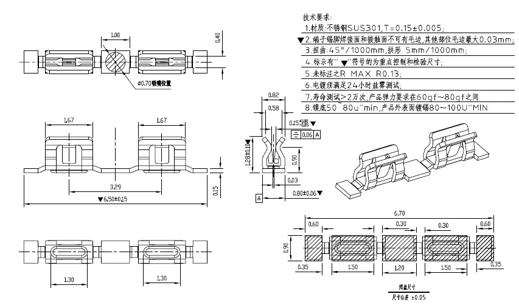
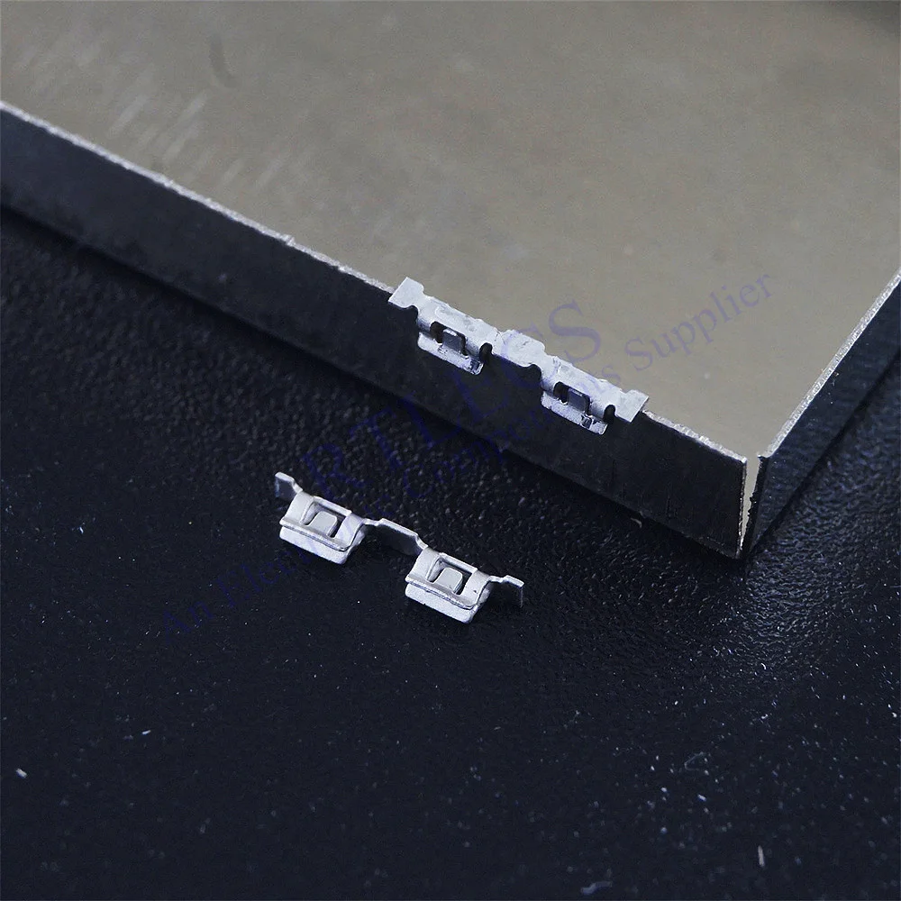
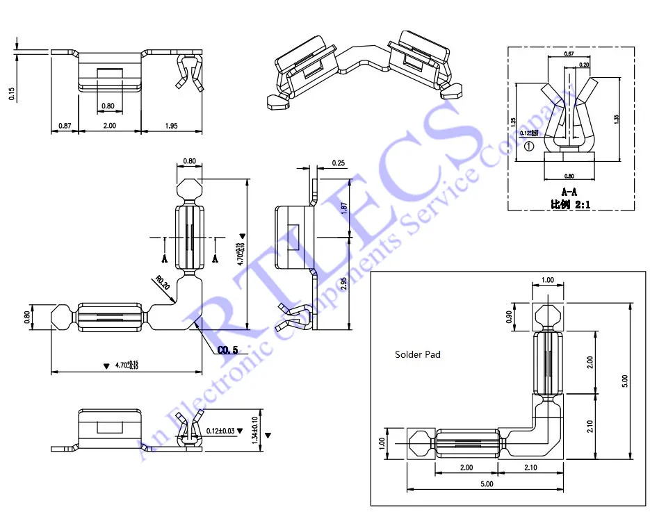
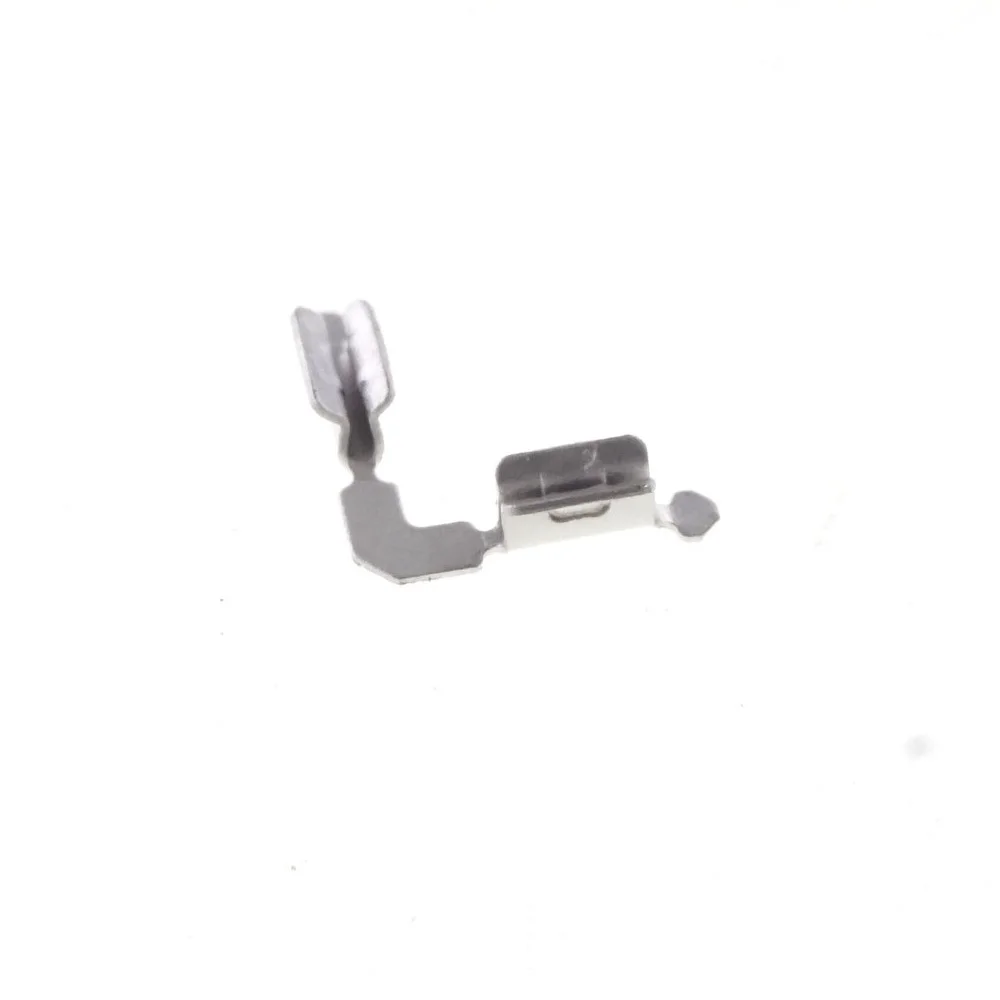

RTLECS
https://aliexpress.ru/store/1264152

S0941-46R

* SMT RFI Shield Clip
* Micro Type
* 6.5 mm Length 1.28 mm Height
* Surface Mount PCB
* Shield Thickness 0.2 mm
* EMI EMC PCB Board Level Shielding
* Stainless Steel
* RoHS compliant
* Reach compliant

* https://aliexpress.ru/item/33003576970.html
* https://www.aliexpress.us/item/3256804675396659.html
* https://www.aliexpress.us/item/2251832817262218.html

* 90 Degree Surface Mount RFI Shield Clip 0.2MM Thick Can Stainless Steel Cross S0981-46R
* Shield Thickness 0.2 mm
* EMI EMC PCB Board Level Shielding
* Stainless Steel
* RoHS compliant
* Reach compliant

* https://www.aliexpress.us/item/3256804534215106.html
*

